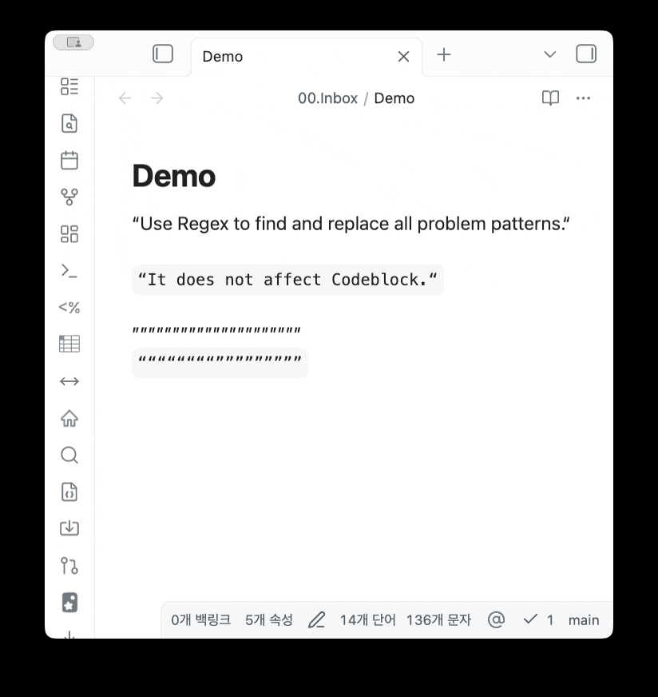

# Obsidian Regex Refiner

[ [English](https://github.com/jaewonE/obsidian_regex_refiner) | [한국어](https://github.com/jaewonE/obsidian_regex_refiner/blob/master/README.ko.md) ]



Obsidian Regex Refiner is an Obsidian community plugin for applying reusable text-refactoring pipelines to the active Markdown note.

Each pipeline is stored as a DAG and contains ordered steps. A step can run either a global regular expression replacement or a global literal text replacement. The plugin is designed for repeatable note cleanup, format conversion, and Markdown-safe refactoring without sending vault data outside Obsidian.

## Purpose

Regex Refiner gives you a command-driven way to run known text transformations without rebuilding the same find-and-replace sequence each time.

Typical uses include:

- Convert recurring markup patterns into another syntax.
- Normalize spacing, line endings, or heading gaps.
- Clean imported Markdown while preserving protected regions.
- Keep several named transformation pipelines and run the right one from a picker.

## Features

- Create, edit, expand, collapse, and delete multiple DAG pipelines from plugin settings.
- Remove DAGs or steps through trash buttons with confirmation before deletion.
- Add ordered `Regex` or `Replace` steps to each DAG.
- Run a DAG from the command palette or an assigned hotkey.
- Select the DAG to run with keyboard arrows, `Enter`, mouse hover, or click.
- Show an empty-state message when no DAGs are configured.
- Export DAG settings as JSON.
- Import JSON and append imported DAGs without overwriting existing DAGs.
- Stop safely when a regex is invalid, leaving the note unchanged.
- Preserve protected Markdown regions:
  - YAML frontmatter
  - fenced code blocks
  - inline code
  - inline and block math
  - Markdown table separators and alignment rows

## How DAG Processing Works

A DAG is a named pipeline of steps. In version `1.0.0`, steps run from top to bottom in the order shown in settings.

For each step:

- `Regex` compiles the **Find** field as a global JavaScript regular expression.
- `Replace` treats the **Find** field as literal text and replaces all occurrences.
- **Replace** is the replacement text for either step type.

If any step has an empty **Find** field or an invalid regex, the DAG does not modify the note.

## Setting Up a DAG

1. Open **Settings -> Community plugins -> Obsidian Regex Refiner**.
2. Select **Add DAG**.
3. Expand the new DAG row.
4. Enter a clear **DAG name**. This is the name shown in the picker.
5. Select **Add step** for each transformation you want to run.
6. For each step, set:
   - **Step name**: a short title for the transformation.
   - **Step description**: a note explaining what the step does.
   - **Step type**: `Regex` or `Replace`.
   - **Find**: the regex pattern or literal text to search for.
   - **Replace**: the replacement text.
7. Keep steps ordered in the sequence you want them to run.
8. Run **Apply regex refiner DAG** from the command palette, or assign it a hotkey in **Settings -> Hotkeys**.

Example DAG:

```json
{
  "name": "Normalize spacing",
  "steps": [
    {
      "name": "Collapse multiple spaces",
      "description": "Convert consecutive spaces into a single space.",
      "type": "Regex",
      "find": " {2,}",
      "replace": " "
    }
  ]
}
```

## JSON Import and Export

Use **Export JSON** to copy the current DAG settings.

Use **Import JSON** to paste settings back into the plugin. Imported DAGs are appended to the existing list, and imported IDs are regenerated so they do not conflict.

Accepted formats:

```json
{
  "dags": [
    {
      "name": "My DAG",
      "steps": [
        {
          "name": "Step 1",
          "description": "Example",
          "type": "Regex",
          "find": "foo",
          "replace": "bar"
        }
      ]
    }
  ]
}
```

```json
[
  {
    "name": "My DAG",
    "steps": []
  }
]
```

## Manual Install

Download the release assets and copy them to:

```text
<Vault>/.obsidian/plugins/obsidian_regex_refiner/
```

Required files:

- `main.js`
- `manifest.json`
- `styles.css`

Reload Obsidian and enable the plugin from **Settings -> Community plugins**.

## Development

Requirements:

- Node.js 18+
- npm

Install dependencies:

```bash
npm install
```

Run a development build:

```bash
npm run dev
```

Create a production build:

```bash
npm run build
```

## License

Obsidian Regex Refiner is released under the GPL-3.0 license.
